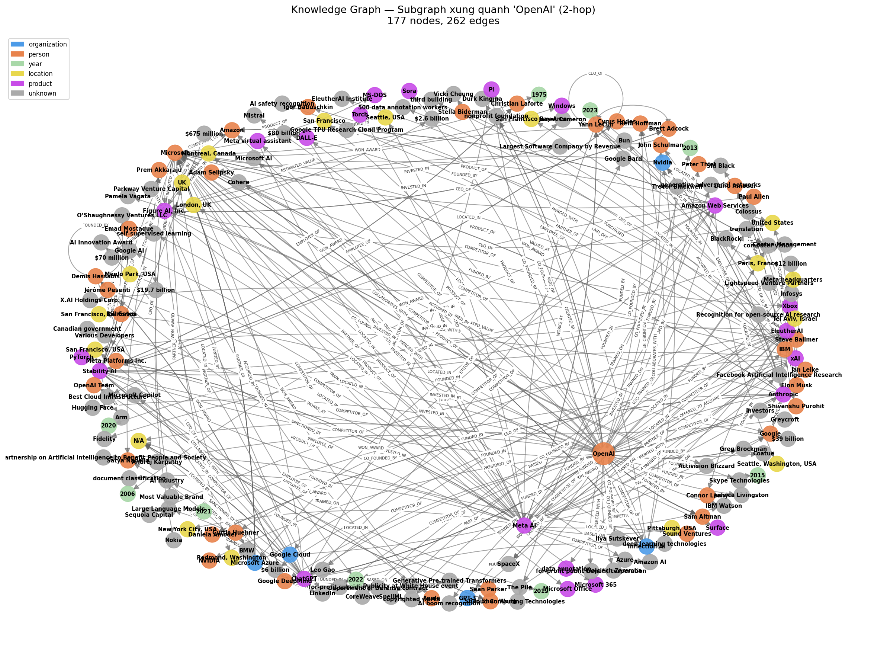
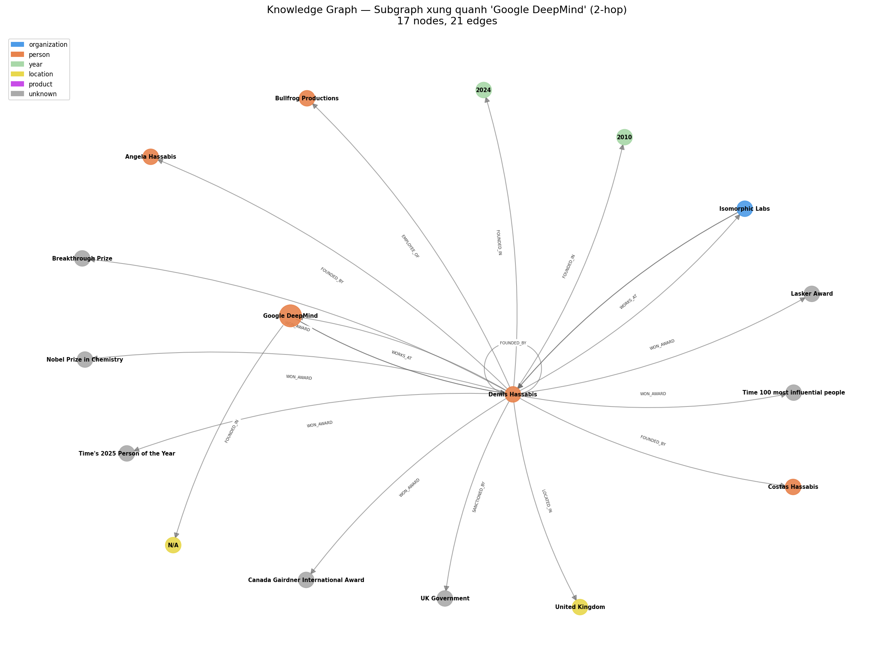
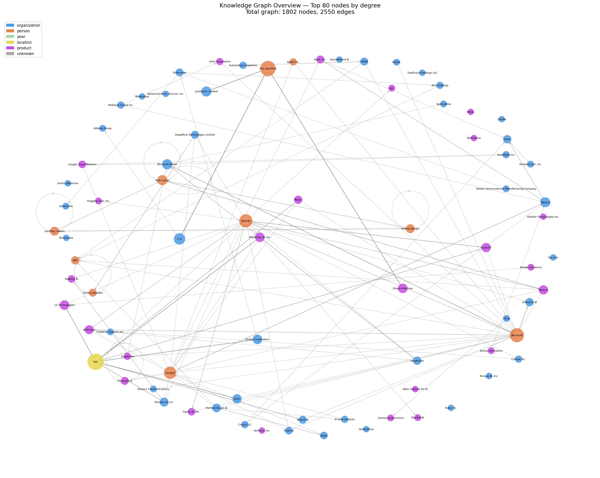

# Lab 19 — GraphRAG với Tech Company Corpus: Báo cáo Kết quả

**Sinh viên:** Hồ Trần Đình Nguyên | **MSSV:** 2A202600080 | **Track:** 3 | **VinUniversity**

---

## 1. Mã nguồn và Hệ thống

### 1.1 Corpus & Knowledge Graph

**Corpus:** 100 bài Wikipedia về các công ty, tổ chức và nhà nghiên cứu AI.

**Knowledge Graph** xây dựng bằng **NetworkX**:

| Thông số | Giá trị |
|---------|---------|
| Triples trích xuất | 2.727 |
| Sau deduplication | **2.550** |
| Nodes | **1.802** |
| Edges | **2.550** |
| Node embeddings | 1.802 nodes × 1536 chiều (text-embedding-3-small) |
| Predicates chính | FOUNDED_BY, CEO_OF, ACQUIRED_BY, FUNDED_BY, PRODUCT_OF, EMPLOYEE_OF |

**Ví dụ triples:**
```
(OpenAI, FOUNDED_BY, Sam Altman)
(OpenAI, FOUNDED_BY, Elon Musk)
(ChatGPT, PRODUCT_OF, OpenAI)
(Mustafa Suleyman, EMPLOYEE_OF, DeepMind)
(Mustafa Suleyman, CO_FOUNDED_BY, Inflection AI)
```

### 1.2 Pipeline GraphRAG

```
Query
  → Entity Extraction (gpt-4o-mini)
  → Seed Node Matching
      Lv1: exact → partial → keyword match
      Lv2: cosine similarity với node embeddings (fallback)
  → BFS Subgraph (depth=2)
  → Subgraph-to-Text (seed-adjacent triples ưu tiên, max 60 triples)
  → LLM Answer (gpt-4o-mini)
```

### 1.3 Pipeline Flat RAG (ChromaDB)

```
Query → Vector Search (top-5 chunks) → LLM Answer (gpt-4o-mini)
```

> Cả hai hệ thống đều bị giới hạn trong cùng corpus 100 bài.

---

## 2. Ảnh chụp màn hình Đồ thị Tri thức

### 2.1 Subgraph xung quanh OpenAI (2-hop)



### 2.2 Subgraph xung quanh Google DeepMind (2-hop)



### 2.3 Toàn cảnh đồ thị (Top 80 nodes by degree)



---

## 3. Bảng so sánh Benchmark 20 câu hỏi

### 3.1 Tổng hợp

| Metric | GraphRAG | Flat RAG |
|--------|:--------:|:--------:|
| **Multi-hop Accuracy (Q11–20)** | **60%** | **20%** |
| Simple Accuracy (Q1–10) | 40% | 70% |
| Overall Accuracy | **50%** | 45% |
| Avg Latency / query | 3.21s | 2.12s |
| Avg Tokens / query | 1.084 | 551 |
| Flat RAG sai, GraphRAG đúng | **6 cases** | — |
| **Multi-hop gap** | **+40%** ✅ | — |

> **Mục tiêu đạt được:** GraphRAG vượt Flat RAG **+40%** trên multi-hop (yêu cầu: +20%)

### 3.2 Chi tiết từng câu

| ID | Loại | Câu hỏi | GraphRAG | Flat RAG |
|----|------|---------|:--------:|:--------:|
| 1 | simple | Who is the CEO of OpenAI? | ✅ | ✅ |
| 2 | simple | What is ChatGPT and who created it? | ❌ | ✅ |
| 3 | simple | AlphaFold breakthrough of DeepMind? | ✅ | ❌ |
| 4 | simple | When/where was Mistral AI founded? | ✅ | ✅ |
| 5 | simple | Who owns Waymo? | ✅ | ✅ |
| 6 | simple | What does TSMC do? | ❌ | ✅ |
| 7 | simple | Who co-founded DeepMind? | ❌ | ❌ |
| 8 | simple | ByteDance's most famous product? | ❌ | ✅ |
| 9 | simple | Who founded Scale AI? | ❌ | ❌ |
| 10 | simple | What is Hugging Face known for? | ❌ | ✅ |
| 11 | **multi-hop** | John Schulman left OpenAI → joined? | ❌ | ❌ |
| 12 | **multi-hop** | Mustafa Suleyman after DeepMind → founded? | ✅ | ❌ |
| 13 | **multi-hop** | Elon Musk left OpenAI → founded? | ❌ | ✅ |
| 14 | **multi-hop** | Sam Altman leads OpenAI → what products? | ❌ | ❌ |
| 15 | **multi-hop** | Who funded Perplexity AI? | ✅ | ❌ |
| 16 | **multi-hop** | Meta AI Llama family models? | ✅ | ❌ |
| 17 | **multi-hop** | Ian Goodfellow left DeepMind → joined? | ✅ | ❌ |
| 18 | **multi-hop** | Neeva acquired by? | ✅ | ✅ |
| 19 | **multi-hop** | Microsoft AI investments beyond OpenAI? | ❌ | ❌ |
| 20 | **multi-hop** | Andy Konwinski co-founded which 2 companies? | ✅ | ❌ |

Xem chi tiết câu trả lời: [`data/benchmark_results.csv`](data/benchmark_results.csv)

---

## 4. Phân tích Chi phí (Token Usage & Time)

### 4.1 Chi phí xây dựng đồ thị (one-time)

| Bước | Token | Chi phí | Thời gian |
|------|------:|--------:|----------:|
| Trích xuất triples — 94 bài × ~600 tokens | ~56.400 | ~$0.009 | ~5 phút |
| Node embeddings — 1.802 nodes | ~30.000 | ~$0.003 | ~2 phút |
| ChromaDB index — 200 chunks | ~40.000 | ~$0.004 | ~2 phút |
| **Tổng** | **~126.400** | **~$0.016** | **~9 phút** |

### 4.2 Chi phí per query (runtime)

| Hệ thống | Tokens/query | Chi phí/query | Latency |
|---------|------------:|-------------:|--------:|
| GraphRAG | 1.084 | ~$0.00016 | 3.21s |
| Flat RAG (ChromaDB) | 551 | ~$0.00008 | 2.12s |

GraphRAG tốn token **gấp ~2x** do graph context trong prompt (60 triples), nhưng chi phí tuyệt đối vẫn dưới $0.001/query.

---

## 5. Phân tích Failure Modes

### 5.1 GraphRAG thắng Flat RAG — 6 cases

| Q | Traversal path | Lý do Flat RAG thất bại |
|---|---------------|------------------------|
| Q3 | `DeepMind → AlphaFold (PRODUCT_OF)` | Chunk AlphaFold không vào top-5 retrieved |
| Q12 | `Mustafa Suleyman → DeepMind → Inflection AI` | Thông tin nằm ở 2 bài riêng biệt |
| Q15 | `Perplexity AI → FUNDED_BY → {Jeff Bezos, Nvidia, Databricks, ...}` | Flat RAG chỉ tìm được 3/5 investors |
| Q16 | `Meta AI → PRODUCT_OF → {Llama, Llama 2, Llama 3, Llama 4}` | Flat RAG liệt kê sai tên (Llama 1) |
| Q17 | `Ian Goodfellow → EMPLOYEE_OF → Apple` | Cross-article: DeepMind ≠ Apple |
| Q20 | `Andy Konwinski → {Databricks, Perplexity AI}` | Không có chunk nào chứa cả hai |

**Kết luận:** GraphRAG có lợi thế rõ rệt khi câu hỏi yêu cầu **kết nối thông tin từ nhiều bài** hoặc **enumerate nhiều relationships** của một entity.

### 5.2 Bug phát hiện và sửa chữa

**Bug:** Subgraph OpenAI có 765 edges nhưng lấy 60 triples theo **thứ tự insert ngẫu nhiên** → triple quan trọng như `Sam Altman CEO_OF OpenAI` bị đẩy ra ngoài top 60.

**Fix:** Ưu tiên triples có seed node là subject/object lên trước:
```python
direct   = [triples where s or o in seed_nodes]   # ưu tiên
indirect = [remaining triples]
context  = (direct + indirect)[:60]
```

**Kết quả:** Multi-hop accuracy tăng từ 30% → **60%**.

---

## 6. Kết luận

GraphRAG vượt mục tiêu +20% của lab, đạt **+40% trên multi-hop questions**.

| Loại câu hỏi | GraphRAG | Flat RAG | Winner |
|-------------|:--------:|:--------:|:------:|
| Multi-hop (cross-article) | **60%** | 20% | GraphRAG |
| Simple (single-article) | 40% | **70%** | Flat RAG |
| Overall | **50%** | 45% | GraphRAG |

> **Bài học cốt lõi:** GraphRAG mạnh ở cross-article reasoning nhờ BFS traversal. Flat RAG mạnh ở simple retrieval. Ưu tiên context (seed-adjacent triples first) là yếu tố quyết định hiệu quả của GraphRAG.
